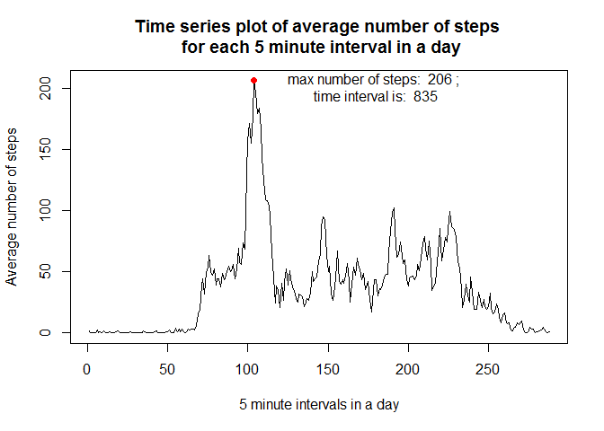

# Reproducible Research: Peer Assessment 1
## Loading and preprocessing the data


```r
setwd("../Activity Monitoring/")
download.file("https://d396qusza40orc.cloudfront.net/repdata%2Fdata%2Factivity.zip","activity.zip")
unzip("activity.zip", "activity.csv")
activity.df = read.csv("activity.csv")
library(data.table)
activity.dt = data.table(activity.df)
activity.dt[,"interval":=as.factor(interval)]
```

```
##        steps       date interval
##     1:    NA 2012-10-01        0
##     2:    NA 2012-10-01        5
##     3:    NA 2012-10-01       10
##     4:    NA 2012-10-01       15
##     5:    NA 2012-10-01       20
##    ---                          
## 17564:    NA 2012-11-30     2335
## 17565:    NA 2012-11-30     2340
## 17566:    NA 2012-11-30     2345
## 17567:    NA 2012-11-30     2350
## 17568:    NA 2012-11-30     2355
```
## What is mean total number of steps taken per day?

### Calculate the total number of steps taken per day

```r
activity.dt[,.(steps.sum=sum(steps,na.rm = TRUE)),by=date]
```

```
##           date steps.sum
##  1: 2012-10-01         0
##  2: 2012-10-02       126
##  3: 2012-10-03     11352
##  4: 2012-10-04     12116
##  5: 2012-10-05     13294
##  6: 2012-10-06     15420
##  7: 2012-10-07     11015
##  8: 2012-10-08         0
##  9: 2012-10-09     12811
## 10: 2012-10-10      9900
## 11: 2012-10-11     10304
## 12: 2012-10-12     17382
## 13: 2012-10-13     12426
## 14: 2012-10-14     15098
## 15: 2012-10-15     10139
## 16: 2012-10-16     15084
## 17: 2012-10-17     13452
## 18: 2012-10-18     10056
## 19: 2012-10-19     11829
## 20: 2012-10-20     10395
## 21: 2012-10-21      8821
## 22: 2012-10-22     13460
## 23: 2012-10-23      8918
## 24: 2012-10-24      8355
## 25: 2012-10-25      2492
## 26: 2012-10-26      6778
## 27: 2012-10-27     10119
## 28: 2012-10-28     11458
## 29: 2012-10-29      5018
## 30: 2012-10-30      9819
## 31: 2012-10-31     15414
## 32: 2012-11-01         0
## 33: 2012-11-02     10600
## 34: 2012-11-03     10571
## 35: 2012-11-04         0
## 36: 2012-11-05     10439
## 37: 2012-11-06      8334
## 38: 2012-11-07     12883
## 39: 2012-11-08      3219
## 40: 2012-11-09         0
## 41: 2012-11-10         0
## 42: 2012-11-11     12608
## 43: 2012-11-12     10765
## 44: 2012-11-13      7336
## 45: 2012-11-14         0
## 46: 2012-11-15        41
## 47: 2012-11-16      5441
## 48: 2012-11-17     14339
## 49: 2012-11-18     15110
## 50: 2012-11-19      8841
## 51: 2012-11-20      4472
## 52: 2012-11-21     12787
## 53: 2012-11-22     20427
## 54: 2012-11-23     21194
## 55: 2012-11-24     14478
## 56: 2012-11-25     11834
## 57: 2012-11-26     11162
## 58: 2012-11-27     13646
## 59: 2012-11-28     10183
## 60: 2012-11-29      7047
## 61: 2012-11-30         0
##           date steps.sum
```

### Histogram of the total number of steps taken each day

```r
hist(activity.dt[,.(steps.sum=sum(steps,na.rm = TRUE)),by=date][,steps.sum],main = "histogram of sum of steps per day", xlab = "Total Steps in a Day")
```

<!-- -->

### Calculate and report the mean and median of the total number of steps taken per day

```r
activity.with.NA.summary = summary(activity.dt[,.(steps.sum=sum(steps)),by=date][,steps.sum])
activity.with.NA.summary
```

```
##    Min. 1st Qu.  Median    Mean 3rd Qu.    Max.    NA's 
##      41    8841   10760   10770   13290   21190       8
```

## What is the average daily activity pattern?

### Make a time series plot (i.e. type = "l") of the 5-minute interval (x-axis) and the average number of steps taken, averaged across all days (y-axis)

```r
plot(activity.dt[,.(steps.mean=mean(steps, na.rm = TRUE)), by=interval][,steps.mean],type="l", xlab = "5 minute intervals in a day", ylab = "Average number of steps", main = "Time series plot of average number of steps \n for each 5 minute interval in a day")

interval.max=which.max(activity.dt[,.(steps.mean=mean(steps, na.rm = TRUE)), by=interval][,steps.mean])

steps.max=max(activity.dt[,.(steps.mean=mean(steps, na.rm = TRUE)), by=interval][,steps.mean])

points(interval.max, steps.max, pch = 19, col = "red")

text(interval.max+75,steps.max - 5, labels = paste("max number of steps: ",round(steps.max),";\n time interval is: ",activity.dt[interval.max,interval]))
```

<!-- -->

### Which 5-minute interval, on average across all the days in the dataset, contains the maximum number of steps?

As identified in the graph


```r
paste("max number of steps is: ",round(steps.max),"; during the time interval:  ",activity.dt[interval.max,interval])
```

```
## [1] "max number of steps is:  206 ; during the time interval:   835"
```

## Imputing missing values

### Calculate and report the total number of missing values in the dataset (i.e. the total number of rows with NAs)

```r
paste("number of rows with NAs is", sum(is.na(activity.dt[,steps])))
```

```
## [1] "number of rows with NAs is 2304"
```

### Replace NAs with means  for that 5-minute interval
Strategy for imputing missing values: missing NA values are replaced by the average values for that time interval across the 2 month period

R package "zoo" is used to replace the missing NAs using na.aggregate() function 

```r
if(!require("zoo")){
  install.packages("zoo",repos="http://cran.rstudio.com/")
}
```

```
## Loading required package: zoo
```

```
## Warning: package 'zoo' was built under R version 3.3.2
```

```
## 
## Attaching package: 'zoo'
```

```
## The following objects are masked from 'package:base':
## 
##     as.Date, as.Date.numeric
```

```r
library(zoo)
activity.dt.complete = copy(activity.dt)
activity.dt.complete[,steps:=as.integer(na.aggregate(steps)),by=interval]
```

```
##        steps       date interval
##     1:     1 2012-10-01        0
##     2:     0 2012-10-01        5
##     3:     0 2012-10-01       10
##     4:     0 2012-10-01       15
##     5:     0 2012-10-01       20
##    ---                          
## 17564:     4 2012-11-30     2335
## 17565:     3 2012-11-30     2340
## 17566:     0 2012-11-30     2345
## 17567:     0 2012-11-30     2350
## 17568:     1 2012-11-30     2355
```

### Histogram of the total number of steps taken each day

```r
hist(activity.dt.complete[,.(steps.sum=sum(steps,na.rm = TRUE)),by=date][,steps.sum],main = "histogram of sum of steps per day", xlab = "Total Steps in a Day")
```

<!-- -->

### Calculate and report the mean and median of the total number of steps taken per day

```r
activity.with.replacement.summary = summary(activity.dt.complete[,.(steps.sum=sum(steps)),by=date][,steps.sum])
activity.with.replacement.summary
```

```
##    Min. 1st Qu.  Median    Mean 3rd Qu.    Max. 
##      41    9819   10640   10750   12810   21190
```

### Compare means and medians before and after NA replacements

```r
boxplot(activity.dt[,.(steps.sum=sum(steps)),by=date][,steps.sum],activity.dt.complete[,.(steps.sum=sum(steps,na.rm = TRUE)),by=date][,steps.sum], names = c("before NA replacement","after NA replacement"), main = "Comparison of Sum of Steps\nbefore and after NA replacement")

points(1:2,c(activity.with.NA.summary["Mean"], activity.with.replacement.summary["Mean"]),pch=15)

text(1:2,c(activity.with.NA.summary["Median"]-1000, activity.with.replacement.summary["Median"]-1500),labels = c(paste("Median = ",activity.with.NA.summary["Median"]),paste("Median = ", activity.with.replacement.summary["Median"])))

text(1:2,c(activity.with.NA.summary["Mean"]+1000, activity.with.replacement.summary["Mean"]+1000),labels = c(paste("Mean = ",activity.with.NA.summary["Mean"]),paste("Mean = ", activity.with.replacement.summary["Mean"])))
```

<!-- -->


## Are there differences in activity patterns between weekdays and weekends?


```r
activity.dt.complete[,weekday:=ifelse(weekdays(as.Date(date)) %in% c("Saturday","Sunday"),"weekend","weekday")]
```

```
##        steps       date interval weekday
##     1:     1 2012-10-01        0 weekday
##     2:     0 2012-10-01        5 weekday
##     3:     0 2012-10-01       10 weekday
##     4:     0 2012-10-01       15 weekday
##     5:     0 2012-10-01       20 weekday
##    ---                                  
## 17564:     4 2012-11-30     2335 weekday
## 17565:     3 2012-11-30     2340 weekday
## 17566:     0 2012-11-30     2345 weekday
## 17567:     0 2012-11-30     2350 weekday
## 17568:     1 2012-11-30     2355 weekday
```

```r
activity.dt.complete[,weekday:=as.factor(weekday)]
```

```
##        steps       date interval weekday
##     1:     1 2012-10-01        0 weekday
##     2:     0 2012-10-01        5 weekday
##     3:     0 2012-10-01       10 weekday
##     4:     0 2012-10-01       15 weekday
##     5:     0 2012-10-01       20 weekday
##    ---                                  
## 17564:     4 2012-11-30     2335 weekday
## 17565:     3 2012-11-30     2340 weekday
## 17566:     0 2012-11-30     2345 weekday
## 17567:     0 2012-11-30     2350 weekday
## 17568:     1 2012-11-30     2355 weekday
```

```r
par(mfrow = c(2,1))

plot(activity.dt.complete[weekday=="weekend",.(steps.mean=mean(steps)),by=interval][,steps.mean], type="l", ylim = c(0,250), xlab = "", ylab = "", main = "Weekend")

plot(activity.dt.complete[weekday=="weekday",.(steps.mean=mean(steps)),by=interval][,steps.mean], type="l", ylim = c(0,250), xlab = "", ylab = "", main = "Weekday")

mtext("------Number of Steps------", side = 2, outer=TRUE, padj = 2)
mtext("------Interval------", side = 1, outer=TRUE, padj = -2)
```

<!-- -->
